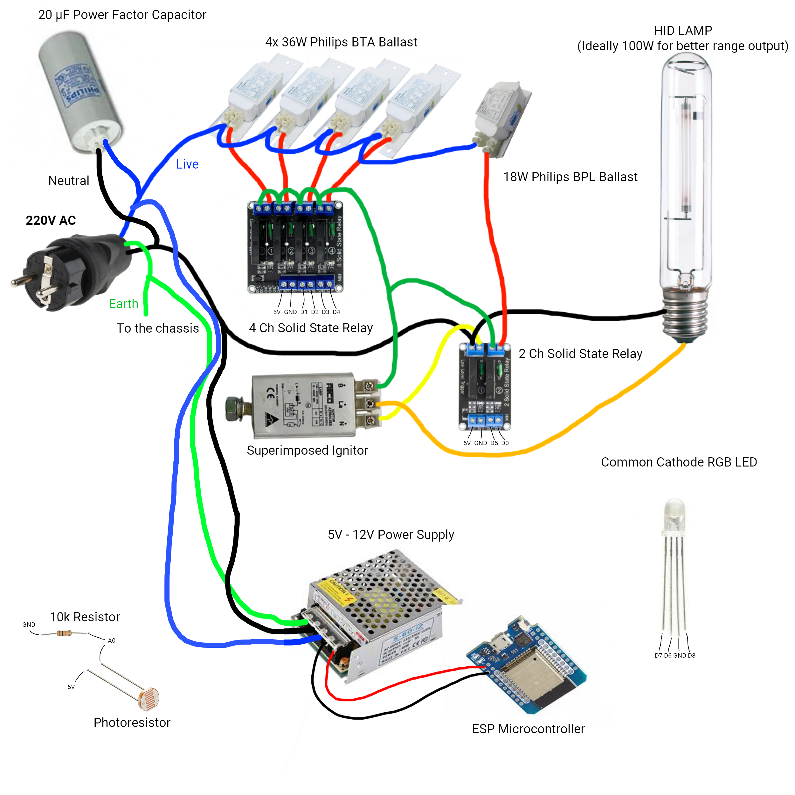
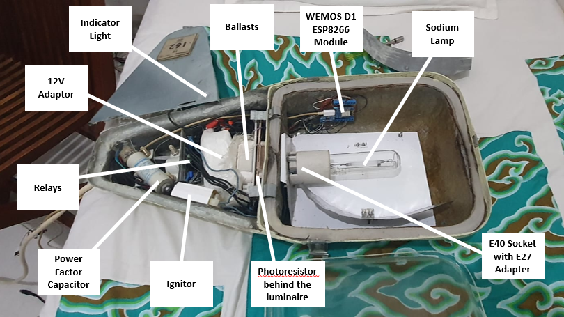

Control your HID Streetlight by using 6 relays.

Ideally, a 4-channel solid-state relay should be used for the 4 x 36-watt Philips BTA Fluorescent Ballast, 2 relays for the 18-watt Philips BPL, and a superimposed ignitor on the neutral side. This doesn't need an additional relay since it uses a series ignitor.

For the large version, use a 4-channel 30A relay: 1 relay for a 100-watt Philips BSN ballast, 1 relay for a 125-watt Philips BHL Ballast, 1 relay to switch on/off the BAG 250W/400W Ballast, and 1 relay to switch between 250W (NO) and 400W (NC) Mode.
You can use an extra Relay to switch on and off the semi-parallel ignitor and connect with a 100W ballast relay signal.

For the small version, the best fixture that I can use is a Philips HRC 502 Street light, but make sure to modify it to E40/Mogul Base first or use an E27 to E40 adapter.

For the large version, I'm going to try on Philips HRC 511 in the future.

-Started from December 2019 by Bahyyazid R H-

Update on May 3 2026:
Added an additional relay for Ignitor Deactivation.

September 6 2026:
ESP32 migration with additional temperature sensor and webpage refurbish.

September 19 2026:
Dynamic WiFi and Telegran Bot Credentials.

CAUTION!!
THIS CAUSES THE BALLAST TO GET HOTTER THAN PRIMARILY USED BY ONE LAMP ONE BALLAST!! MAKE SURE YOU KNOW WHAT YOU'RE DOING!!
UNLESS YOU ARE TRYING TO SWAP THE BALLAST TERMINAL TO THE HEAT RESISTANCE SCREW TERMINAL OR ADD AN ADDITIONAL COOLING FAN.

DEMO VIDEO

